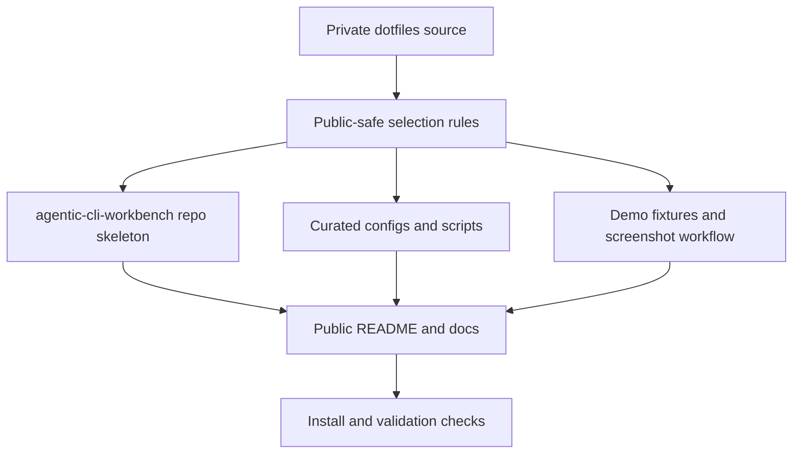

# Project Roadmap

`PLAN.md` is the project-level roadmap and status index. Keep executable
implementation detail in `.vault/plans/`.

## Current State

- The dotfiles repo is the private source of truth for shared agent workflows,
  terminal tooling, platform overlays, package manifests, and bootstrap checks.
- The next public-facing effort is `agentic-cli-workbench`: a curated showcase
  repo that presents the tmux agent workbench without mirroring private host
  snapshots, secrets, local projects, or live account state.
- Current screenshot pass is staged for user capture: Hermes opens
  `hermes --tui` in the left reference pane, and Codex starts with the requested
  yazi/yazi/lazygit first window.
- The README now includes the approved macOS Codex-IDE GoodNotes screenshot as
  the navigation-cockpit example.
- Existing evidence lives in `docs/terminal-tooling-reference.md`,
  `docs/codex-agentic-framework.md`, `configs/shared/term-scripts/`,
  `configs/shared/tmux/tmux.conf`, `configs/shared/yazi/`,
  `configs/shared/lazygit/`, and platform profile configs.

## Active Plans

| Feature Plan | Feature | Status | Next Action |
|---|---|---|---|
| `.vault/plans/001-codex-agents-doc-sync-2026-05-24.md` | Shared Codex and `.agents` sync | Existing | Reference only unless refreshed |
| `.vault/plans/002-agentic-cli-workbench-public-repo-skeleton-2026-05-28.md` | Public repo identity, structure, README, and docs skeleton | Complete | Included in release gate |
| `.vault/plans/003-agentic-cli-workbench-curated-config-export-2026-05-28.md` | Curated public config subset and private/public boundary | Complete | Included in release gate |
| `.vault/plans/004-agentic-cli-workbench-demo-session-and-screenshots-2026-05-28.md` | Demo session scripts and sanitized screenshot pipeline | Complete | Included in release gate |
| `.vault/plans/005-agentic-cli-workbench-public-agent-framework-docs-2026-05-28.md` | Public agent workflow docs and commit convention | Complete | Included in release gate |
| `.vault/plans/006-agentic-cli-workbench-install-validation-2026-05-28.md` | Install, doctor, and validation workflow for visitors | Complete | Included in release gate |
| `.vault/plans/007-agentic-cli-workbench-release-verification-2026-05-28.md` | Final privacy, history, release, and publication gate | Complete | Await user approval before public push |

## Active Goal Runs

| Goal Run | Coordinates | Status | Next Action |
|---|---|---|---|
| `.vault/goals/goal-agentic-cli-workbench-2026-05-28/` | Plans 002-007 | Complete | Await user approval before public push |

## Primary Goals

1. Create a new GitHub repo named `agentic-cli-workbench` as a polished public
   showcase of the user's modern CLI agent workbench.
2. Export only portable, public-safe configs and docs from this dotfiles repo.
3. Provide repeatable demo sessions, sanitized screenshots, and validation so
   visitors can understand and adapt the workflow.

## Success Criteria

- [x] Public repo can be generated or assembled without private overlays,
      snapshots, secrets, emails, or machine-specific trust state.
- [x] README explains the workbench story with screenshots, platform split,
      command quickstart, and clear non-included boundaries.
- [x] Demo tmux sessions can produce clean Hermes/Codex/yazi/lazygit layouts for
      screenshots without exposing personal repositories or git identity.
- [x] Windows/WSL and macOS paths are documented as sibling profiles, not mixed
      into one ambiguous setup.
- [x] Atomic commit convention is documented in repo instructions and examples.

## Architecture Snapshot



ASCII fallback:

```text
private dotfiles -> public-safe export -> repo/docs/configs/demo -> validation
```

## Decision Index

| Decision | Rationale | Date | Link |
|:---------|:----------|:-----|:-----|
| Public showcase repo, not full dotfiles mirror | Keeps the public repo useful while protecting private overlays, host state, and live agent details | 2026-05-28 | `.vault/decisions/agentic-cli-workbench-public-boundary-2026-05-28.md` |

## Risk Register

| Risk | Impact | Likelihood | Mitigation | Owner |
|:-----|:-------|:-----------|:-----------|:------|
| Private data leaks through screenshots, lazygit, paths, config, or package snapshots | High | Med | Use demo fixtures, sanitized configs, and explicit export denylist | security |
| Repo becomes too broad and reads like a raw dotfiles dump | Med | Med | Keep plans bite-sized and README narrative-first | planner |
| Public setup drifts from private source | Med | Med | Treat dotfiles as source and public repo as curated export with validation | implementer |
| Platform docs overpromise exact parity | Med | Low | Present Windows/WSL and macOS as parallel profile layers with shared core | reviewer |

## Knowledge Index

- Research: `.vault/research/agentic-cli-workbench-source-inventory-2026-05-28.md`
- Decisions: `.vault/decisions/`
- Solutions: `.vault/solutions/`
- Encounters: `.vault/encounters/`
- Goal runs: `.vault/goals/goal-agentic-cli-workbench-2026-05-28/`
- Visual companions: `.vault/visuals/`

## Maintenance Notes

- Update this file when any `agentic-cli-workbench` feature plan is completed,
  paused, or replaced.
- Keep private dotfiles edits separate from public repo export work.
- Promote durable export, sanitization, and workflow decisions into
  `.vault/decisions/`.
