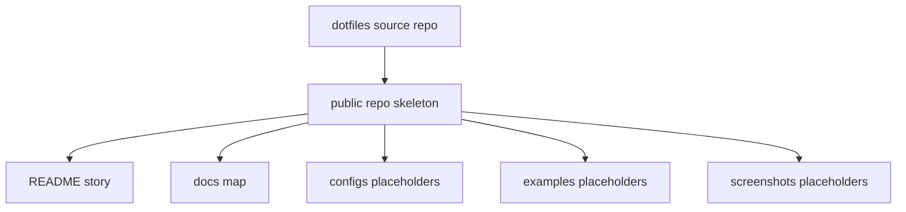

# Agentic CLI Workbench: Public Repo Skeleton

## Goal

- Create the initial `agentic-cli-workbench` public repo structure.
- Establish the README narrative, docs map, platform split, and public/private
  boundary before copying configs.
- Make the repo feel like a polished workflow showcase, not a raw dotfiles dump.

## Starting Point

- Current behavior: dotfiles already contains the workbench source material, but
  public repo structure does not exist yet.
- Read first:
  - `.vault/research/agentic-cli-workbench-source-inventory-2026-05-28.md`
  - `.vault/decisions/agentic-cli-workbench-public-boundary-2026-05-28.md`
  - `docs/terminal-tooling-reference.md`
  - `docs/codex-agentic-framework.md`

## Non-Goals and Boundaries

- Do not copy private overlays, host snapshots, live configs, or raw screenshots.
- Do not publish the full Codex skill tree in this plan.
- Do not create real GitHub remote or push unless the user explicitly asks.

## Related Artifacts

- Research: `.vault/research/agentic-cli-workbench-source-inventory-2026-05-28.md`
- Decision: `.vault/decisions/agentic-cli-workbench-public-boundary-2026-05-28.md`
- Goal run: `.vault/goals/goal-agentic-cli-workbench-2026-05-28/`

## Success Criteria

- [x] New repo folder or worktree exists with public-safe skeleton.
- [x] README includes screenshots placeholders, concept, quickstart, platform
      split, command table, and "intentionally not included" section.
- [x] Docs skeleton includes `overview.md`, `windows-wsl.md`, `macos.md`,
      `tmux-layouts.md`, `agent-workflows.md`, and `security-and-sanitization.md`.
- [x] Commit guidance is documented for this repo using uppercase atomic types.

## Architecture Diagram



## ADR Summary

- Decision: start with public repo structure and story before config export.
- Drivers: safety, reviewability, and clearer visitor experience.
- Alternatives considered: copy configs first, or publish dotfiles directly.
- Consequences: later plans have a stable destination layout.
- Promote to `.vault/decisions/`: already captured.

## Worktree Session

- Required: Yes.
- Recommended command: `bash ~/.agents/skills/core/git-worktree/scripts/worktree-manager.sh create agentic-cli-workbench-skeleton --from main`
- Branch plan: `codex/agentic-cli-workbench-skeleton` for dotfiles planning
  edits; use a separate new repo path for the public repo when implementing.
- Review note: confirm no private files are copied into the new repo.

## Execution Steps

- [x] Create public repo folder and baseline files.
  - ACTION: create `README.md`, `LICENSE`, `.gitignore`, `docs/`,
    `configs/`, `scripts/`, `examples/`, `screenshots/`, and `packages/`.
  - FILES: new repo root.
  - VALIDATE: `find . -maxdepth 3 -type f | sort`.

- [x] Draft narrative README.
  - ACTION: explain the workbench as agent pane + file navigation + git state +
    theme coherence.
  - IMPLEMENT: include platform comparison table and "not included" boundary.
  - VALIDATE: manual read for clarity and privacy.

- [x] Add docs placeholders.
  - ACTION: add one-page docs for overview, platform setup, layouts, workflow,
    and sanitization.
  - GOTCHA: keep details concise until config export confirms exact paths.
  - VALIDATE: `rg -n "TODO|PRIVATE|gilgames|wtergan|gmail" .`.

## Testing Strategy

- No code behavior changes in this plan.
- Use text checks for private identifiers and broken links.
- Future tests land in plans 004 and 006.

## Verification Contract

- Primary commands:
  - `rg -n "gmail|gilgames|wtergan|/home/|/mnt/c/Users|Vault|private" .`
  - `find . -maxdepth 3 -type f | sort`
- Required proof: repo skeleton exists and contains no private identifiers.

## Goal Contract

```text
Objective:
Create the initial public repo skeleton for agentic-cli-workbench with a polished README, docs map, and public/private boundary.

Starting point:
Use .vault/plans/002-agentic-cli-workbench-public-repo-skeleton-2026-05-28.md from /home/gilgames/Code/agentic-cli-workbench.

Read first:
- .vault/PLAN.md
- .vault/research/agentic-cli-workbench-source-inventory-2026-05-28.md
- .vault/decisions/agentic-cli-workbench-public-boundary-2026-05-28.md
- docs/terminal-tooling-reference.md

Constraints:
- Do not publish private overlays, host snapshots, raw screenshots, emails, local project names, or live Codex/Desktop state.
- Do not push or create a GitHub remote without explicit user approval.
- Commit messages must use uppercase atomic type subjects such as FEAT:, DOCS:, TEST:, CHORE:, FIX:, followed by at most four information-dense one-line bullets.

Iteration policy:
- Work in small milestones.
- Run focused privacy checks after each milestone.
- If validation fails, fix and rerun once.
- Capture durable decisions, solutions, and encounters as they arise.

Verification:
- rg private-identifier checks over the public repo.
- Manual README/docs review for clarity.

Stop conditions:
- Success: public skeleton is ready for config export.
- Ask user: remote creation, license choice uncertainty, or any public identity claim beyond the supplied workflow story.
- Blocker: repeated privacy check failure or unclear source ownership.

Final evidence:
- New repo path, created files, validation commands, and remaining next plan.
```

## Risks and Mitigations

| Risk | Likelihood | Impact | Mitigation |
|------|------------|--------|------------|
| Skeleton overfits private repo layout | Med | Med | Use visitor-facing names and only public-safe placeholders |
| README becomes too abstract | Med | Med | Anchor it in tmux/yazi/lazygit/agent screenshots and commands |

## Progress Log

- 2026-05-28: Plan created.
