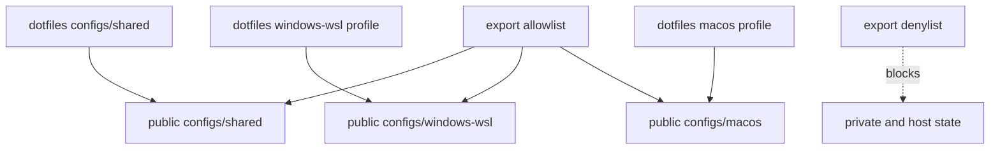

# Agentic CLI Workbench: Curated Config Export

## Goal

- Export the public-safe core configs and scripts into `agentic-cli-workbench`.
- Preserve the shared workbench shape while separating Windows/WSL and macOS
  terminal-specific layers.
- Add a denylist/allowlist discipline so future syncs do not leak private state.

## Starting Point

- Read first:
  - `.vault/plans/002-agentic-cli-workbench-public-repo-skeleton-2026-05-28.md`
  - `.vault/research/agentic-cli-workbench-source-inventory-2026-05-28.md`
  - `configs/shared/term-scripts/ide`
  - `configs/shared/tmux/tmux.conf`
  - `configs/shared/yazi/`
  - `configs/shared/lazygit/config.yml`
  - `configs/profiles/windows-wsl/`
  - `configs/profiles/macos/terminal/ghostty/ghostty-macos.config`

## Non-Goals and Boundaries

- Do not copy `private/`, `hosts/`, live auth, generated hashes, raw package
  snapshots, or full imported skill bundles.
- Do not rewrite the private source files unless an export blocker is found.
- Keep public examples generic; avoid machine usernames and local project names.

## Success Criteria

- [ ] Public repo has `configs/shared/` for tmux, yazi, lazygit, term scripts,
      and shell helpers.
- [ ] Public repo has `configs/windows-wsl/` for WezTerm and WSL notes.
- [ ] Public repo has `configs/macos/` for Ghostty and macOS notes.
- [ ] Export checklist or script documents the allowlist and denylist.
- [ ] Privacy checks pass over exported files.

## Architecture Diagram



## Worktree Session

- Required: Yes.
- Recommended command: `bash ~/.agents/skills/core/git-worktree/scripts/worktree-manager.sh create agentic-cli-workbench-config-export --from main`
- Review note: use `git diff --stat` and privacy `rg` checks before any commit.

## Execution Steps

- [ ] Define public export map.
  - ACTION: create `docs/export-policy.md` or `scripts/export-public-subset`.
  - IMPLEMENT: include allowlist for shared workbench files and denylist for
    private/host/live state.
  - VALIDATE: manual review plus `rg` privacy terms.

- [ ] Copy shared terminal workbench files.
  - FILES: `ide`, agent wrappers, tmux config, yazi, lazygit, `tmux-fzf-*`,
    `tmux-notify-hook`, `tmux-validate`, `weztheme`, `ghosttheme`.
  - GOTCHA: replace hardcoded private paths with generic examples or docs.
  - VALIDATE: shell syntax checks for scripts.

- [ ] Copy platform examples.
  - FILES: WezTerm config examples, Ghostty config examples, package manifests.
  - IMPLEMENT: use minimal public package lists instead of raw host snapshots.
  - VALIDATE: privacy and portability review.

## Testing Strategy

- Add lightweight shell tests only where scripts are modified or wrapped.
- Use existing tests as reference:
  - `tests-2/ide-agent-variant-scripts-should-launch-configured-agent_test.sh`
  - `tests-2/ghosttheme-mode-and-preview-should-support-light-dark-workflows_test.sh`
  - `tests-2/weztheme-hermes-skin-sync-should-be-env-driven_test.sh`

## Verification Contract

- Primary commands:
  - `bash -n configs/shared/term-scripts/*`
  - `rg -n "gmail|gilgames|wtergan|/home/|/mnt/c/Users|private|hosts/" .`
  - public repo test runner when present.
- Required proof: exported subset is runnable or clearly documented as example
  config, with denylisted files absent.

## Goal Contract

```text
Objective:
Export the public-safe agentic CLI workbench config subset into agentic-cli-workbench.

Starting point:
Use .vault/plans/003-agentic-cli-workbench-curated-config-export-2026-05-28.md after the public repo skeleton exists.

Read first:
- .vault/research/agentic-cli-workbench-source-inventory-2026-05-28.md
- .vault/decisions/agentic-cli-workbench-public-boundary-2026-05-28.md
- docs/terminal-tooling-reference.md
- configs/shared/term-scripts/ide
- configs/shared/tmux/tmux.conf

Constraints:
- Export from an allowlist; never bulk-copy private, host, live, cache, auth, or generated state.
- Keep platform layers explicit: shared core, windows-wsl, macos.
- Use uppercase atomic commit convention.

Verification:
- bash syntax checks for scripts.
- privacy rg checks over the public repo.
- targeted layout wrapper tests when copied or adapted.

Stop conditions:
- Success: curated configs are exported and privacy checks pass.
- Ask user: any questionable personal config, third-party bundle, or identity claim.
- Blocker: exported scripts depend on private-only paths that need redesign.

Final evidence:
- Exported file list, validation output, and remaining demo/screenshot work.
```

## Risks and Mitigations

| Risk | Likelihood | Impact | Mitigation |
|------|------------|--------|------------|
| Accidental secret or identity leak | Med | High | Allowlist export and repeated privacy rg checks |
| Public copy becomes stale | Med | Med | Document source paths and export policy |

## Progress Log

- 2026-05-28: Plan created.
