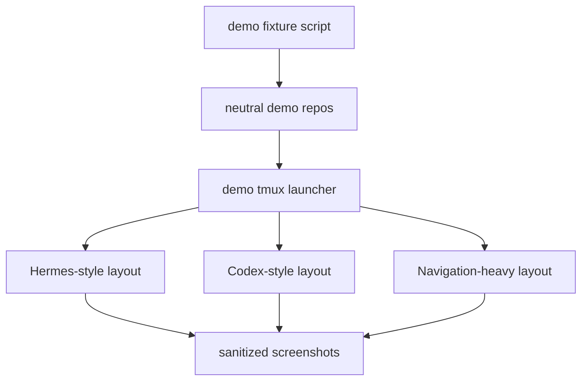

# Agentic CLI Workbench: Demo Session And Screenshots

## Goal

- Build repeatable demo sessions for public screenshots.
- Show real tmux/yazi/lazygit/agent layouts without exposing personal repos,
  email, git identity, local files, or active work.
- Provide screenshot guidance for Hermes, Codex, navigation-heavy, and theme
  picker views.

## Starting Point

- The attached screenshots prove the desired visual language but are not safe to
  publish directly.
- Read first:
  - `.vault/research/agentic-cli-workbench-source-inventory-2026-05-28.md`
  - `configs/shared/term-scripts/ide`
  - `tests-2/ide-agent-variant-scripts-should-launch-configured-agent_test.sh`

## Non-Goals and Boundaries

- Do not publish current screenshots as-is.
- Do not require paid APIs or real agent auth for screenshots.
- Do not fake the terminal with image generation as the primary proof; generated
  or edited images may support, but real sanitized terminal captures are primary.

## Success Criteria

- [x] Demo fixture script creates neutral repos/files with fake git history.
- [x] Demo session command launches Hermes-like, Codex-like, and navigation-heavy
      layouts.
- [x] Codex screenshot demo window 1 uses left `yazi`, top-right `yazi`, and
      bottom-right `lazygit`.
- [x] Hermes screenshot demo window 1 opens `hermes --tui` in the left pane when
      Hermes is installed.
- [x] README includes the approved macOS Codex-IDE GoodNotes screenshot.
- [x] Screenshot checklist covers terminal size, theme, redaction, and privacy.
- [x] `screenshots/` contains sanitized captures or placeholders with exact
      capture steps.

## Architecture Diagram



## Execution Steps

- [x] Create demo fixtures.
  - ACTION: generate neutral project directories, files, and git commits.
  - IMPLEMENT: use fake author data local to the demo repo if git identity is
    needed.
  - VALIDATE: `git log --format=fuller` shows no personal email.

- [x] Create demo launcher.
  - ACTION: add `scripts/demo-session` with modes for `hermes`, `codex`, and
    `nav`.
  - IMPLEMENT: prefer same tmux layout engine; allow mock agent panes when real
    tools are unavailable.
  - VALIDATE: tmux command log tests or manual smoke run.

- [x] Capture public visuals.
  - ACTION: capture full terminal screenshots after running demo modes.
  - IMPLEMENT: crop only terminal content; avoid OS title bars if they add no
    value.
  - VALIDATE: visual inspection plus OCR/manual privacy review.

## Testing Strategy

- Add shell tests for fixture generation and launcher command composition.
- Use behavior-first names such as
  `demo-session-hermes-should-launch-public-safe-layout_test.sh`.

## Verification Contract

- Primary commands:
  - `git -C <demo-repo> log --format=fuller`
  - `rg -n "gmail|gilgames|wtergan|/home/|/mnt/c/Users|Vault|lcdm|dotfiles" screenshots docs scripts examples`
  - demo launcher smoke test.
- Required proof: clean screenshots or exact capture recipe using demo data.

## Goal Contract

```text
Objective:
Create repeatable public-safe demo sessions and screenshots for agentic-cli-workbench.

Starting point:
Use .vault/plans/004-agentic-cli-workbench-demo-session-and-screenshots-2026-05-28.md after curated configs exist.

Read first:
- configs/shared/term-scripts/ide
- tests-2/ide-agent-variant-scripts-should-launch-configured-agent_test.sh
- .vault/research/agentic-cli-workbench-source-inventory-2026-05-28.md

Constraints:
- Do not publish current raw screenshots.
- Do not expose real git identity, local project names, file paths, or account state.
- Prefer real sanitized terminal captures over generated-only images.
- Use uppercase atomic commit convention.

Verification:
- Demo fixture identity checks.
- Privacy rg checks over screenshots metadata/docs/scripts where possible.
- Manual screenshot review.

Stop conditions:
- Success: screenshots or screenshot-ready demo sessions exist with no private content.
- Ask user: whether to use real agent binaries or mock panes for final public captures.
- Blocker: inability to create sanitized lazygit/yazi state without leaking identity.

Final evidence:
- Demo commands, screenshot paths, privacy checks, and capture notes.
```

## Risks and Mitigations

| Risk | Likelihood | Impact | Mitigation |
|------|------------|--------|------------|
| Visuals look fake if fully generated | Med | Med | Use real terminal demo fixtures as primary |
| Raw local state leaks into lazygit/yazi | Med | High | Use neutral demo repos and fake local git identity |

## Progress Log

- 2026-05-28: Plan created.
- 2026-05-29: Reopened for screenshot-template delta. Codex demo now starts on
  the requested yazi/yazi/lazygit first window, and Hermes demo opens
  `hermes --tui` in the left reference pane when available.
- 2026-05-29: Added user-approved
  `screenshots/codex-ide-macos-goodnotes.png` to README as the macOS Codex-IDE
  workflow example.
