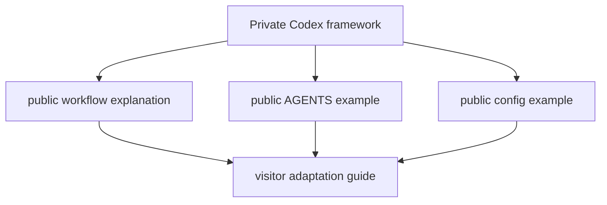

# Agentic CLI Workbench: Public Agent Framework Docs

## Goal

- Document the public, adaptable agent workflow behind the terminal workbench.
- Include a public `AGENTS.md` example, prompt/skill overview, `.vault`
  operational memory explanation, and uppercase atomic commit convention.
- Keep private Codex configuration and personal memory out of the public repo.

## Starting Point

- Read first:
  - `docs/codex-agentic-framework.md`
  - `configs/shared/codex/AGENTS.md`
  - `configs/shared/codex/prompts/plan.md`
  - `.vault/decisions/agentic-cli-workbench-public-boundary-2026-05-28.md`

## Non-Goals and Boundaries

- Do not publish live `~/.codex/config.toml` or Desktop state.
- Do not publish full imported third-party skill bundles in this plan.
- Do not imply visitors must use the exact same private workflow to benefit.

## Success Criteria

- [ ] `docs/agent-workflows.md` explains research -> plan -> implement ->
      validate, native `/goal`, `.vault`, and specialist roles.
- [ ] `examples/AGENTS.public.md` contains portable project instructions.
- [ ] `examples/codex-config.public.toml` shows only safe illustrative config.
- [ ] Commit convention is documented in public repo and source framework.

## Architecture Diagram



## Execution Steps

- [ ] Draft public workflow doc.
  - ACTION: summarize the workflow without copying private details wholesale.
  - IMPLEMENT: include `.vault` as operational memory and `/goal` as runtime.
  - VALIDATE: privacy review.

- [ ] Add public examples.
  - ACTION: create `examples/AGENTS.public.md` and safe Codex config examples.
  - IMPLEMENT: avoid MCP URLs, auth, trust roots, machine paths, and local names.
  - VALIDATE: `rg` privacy check.

- [ ] Wire commit convention.
  - ACTION: ensure source framework and public docs both specify uppercase atomic
    commit format.
  - IMPLEMENT: subject line uses `TYPE: summary`; optional body has at most four
    one-line bullets.
  - VALIDATE: docs mention examples such as `FEAT:`, `DOCS:`, `TEST:`, `FIX:`,
    and `CHORE:`.

## Verification Contract

- Primary commands:
  - `rg -n "Commit|FEAT:|DOCS:|TEST:|FIX:|CHORE:" docs examples configs/shared/codex docs/codex-agentic-framework.md`
  - `rg -n "gmail|/home/|/mnt/c/Users|auth|token|secret|private" docs examples`
- Required proof: public docs explain the workflow and commit convention without
  private config leakage.

## Goal Contract

```text
Objective:
Create public agent workflow docs and examples for agentic-cli-workbench while preserving private Codex framework boundaries.

Starting point:
Use .vault/plans/005-agentic-cli-workbench-public-agent-framework-docs-2026-05-28.md.

Read first:
- docs/codex-agentic-framework.md
- configs/shared/codex/AGENTS.md
- configs/shared/codex/prompts/plan.md

Constraints:
- Summarize private framework concepts rather than publishing live private config.
- Include uppercase atomic commit convention.
- Use safe examples only.

Verification:
- Privacy rg checks.
- Manual review for clear, visitor-friendly workflow docs.

Stop conditions:
- Success: public docs/examples are ready and source framework contains commit rules.
- Ask user: whether to publish any actual skills or keep them summarized.
- Blocker: unclear licensing or ownership for any imported skill material.

Final evidence:
- Docs/example paths, privacy check results, and commit convention references.
```

## Risks and Mitigations

| Risk | Likelihood | Impact | Mitigation |
|------|------------|--------|------------|
| Public docs reveal too much personal operating policy | Med | Med | Write a public edition instead of copying framework verbatim |
| Agent framework overwhelms terminal showcase | Med | Low | Keep it as an optional docs chapter |

## Progress Log

- 2026-05-28: Plan created.
