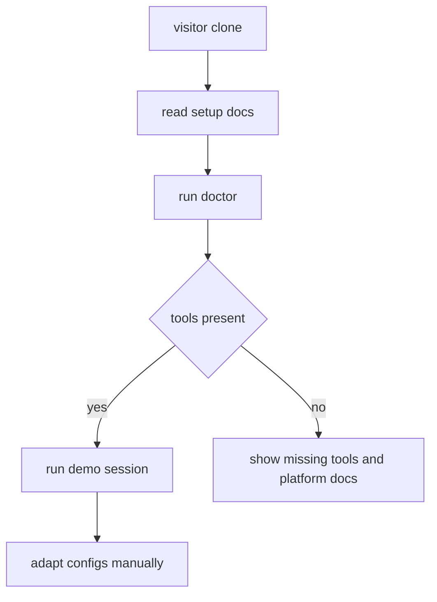

# Agentic CLI Workbench: Install And Validation

## Goal

- Add practical setup and validation for visitors who want to adapt the public
  workbench.
- Keep install steps cautious and transparent rather than auto-mutating a user's
  machine without consent.
- Provide platform-specific smoke checks for Windows/WSL and macOS.

## Starting Point

- Read first:
  - `.vault/plans/003-agentic-cli-workbench-curated-config-export-2026-05-28.md`
  - `.vault/plans/004-agentic-cli-workbench-demo-session-and-screenshots-2026-05-28.md`
  - `scripts/dotfiles`
  - `scripts/lib/commands/doctor.sh`
  - `scripts/lib/commands/verify.sh`

## Non-Goals and Boundaries

- Do not ship a one-command destructive installer.
- Do not assume visitors have the same agents, terminals, shells, or package
  manager state.
- Do not require Codex, Hermes, or OpenCode auth to validate the workbench.

## Success Criteria

- [ ] `scripts/doctor` or equivalent checks required tools and explains missing
      dependencies.
- [ ] Setup docs separate prerequisites, optional agents, theme scripts, and demo
      screenshot workflow.
- [ ] Tests cover script syntax and demo/doctor behavior.
- [ ] README has a clear "try the demo first" path.

## Architecture Diagram



## Execution Steps

- [ ] Add doctor script.
  - ACTION: check `tmux`, `fzf`, `rg`, `yazi`, `lazygit`, terminal theme
    script prerequisites, and optional agent commands.
  - IMPLEMENT: report only; do not install by default.
  - VALIDATE: shell tests with stubbed PATH.

- [ ] Add setup docs.
  - ACTION: document Windows/WSL and macOS setup paths.
  - IMPLEMENT: separate shared core from terminal-specific pieces.
  - VALIDATE: link check and manual review.

- [ ] Add validation workflow.
  - ACTION: document smoke commands and expected output.
  - IMPLEMENT: include demo session validation and privacy checks for contributors.
  - VALIDATE: run tests and `bash -n`.

## Testing Strategy

- Behavior-first shell tests:
  - `doctor-missing-tools-should-report-actionable-guidance_test.sh`
  - `demo-session-without-agent-should-use-mock-pane_test.sh`
  - `public-export-should-not-include-private-identifiers_test.sh`

## Verification Contract

- Primary commands:
  - `bash -n scripts/*`
  - test runner for public repo.
  - `rg -n "gmail|gilgames|wtergan|/home/|/mnt/c/Users|private" .`
- Required proof: visitor can run a non-destructive check and see how to start a
  demo without private dependencies.

## Goal Contract

```text
Objective:
Add non-destructive setup, doctor, and validation workflows for agentic-cli-workbench.

Starting point:
Use .vault/plans/006-agentic-cli-workbench-install-validation-2026-05-28.md after config export and demo session plans.

Read first:
- scripts/dotfiles
- scripts/lib/commands/doctor.sh
- scripts/lib/commands/verify.sh
- docs/terminal-tooling-reference.md

Constraints:
- Do not make destructive machine changes.
- Keep missing tools actionable but optional agent auth optional.
- Use uppercase atomic commit convention.

Verification:
- bash syntax checks.
- stubbed doctor tests.
- privacy checks.

Stop conditions:
- Success: public repo has clear setup, doctor, and validation paths.
- Ask user: before adding auto-install behavior or platform package manager mutation.
- Blocker: validation requires private tools or credentials.

Final evidence:
- Doctor output summary, test results, and setup docs paths.
```

## Risks and Mitigations

| Risk | Likelihood | Impact | Mitigation |
|------|------------|--------|------------|
| Installer mutates visitor machines unexpectedly | Low | High | Keep doctor report-only by default |
| Optional agent tools block demo | Med | Med | Provide mock-pane fallback |

## Progress Log

- 2026-05-28: Plan created.
