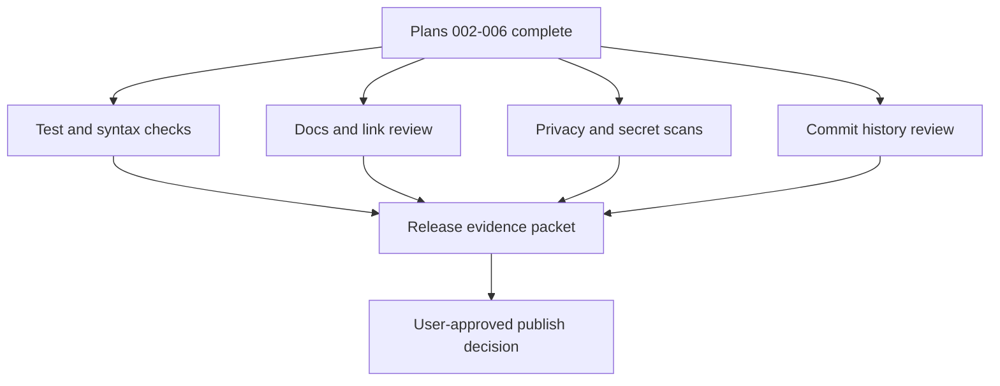

# Agentic CLI Workbench: Release Verification

## Goal

- Run the final release gate for `agentic-cli-workbench`.
- Verify privacy, screenshots, docs, tests, public history, and atomic commit
  structure before any user-approved publication.
- Prepare a clean final evidence packet for the user.

## Starting Point

- Read first:
  - `.vault/goals/goal-agentic-cli-workbench-2026-05-28/progress.md`
  - `.vault/plans/002-agentic-cli-workbench-public-repo-skeleton-2026-05-28.md`
  - `.vault/plans/003-agentic-cli-workbench-curated-config-export-2026-05-28.md`
  - `.vault/plans/004-agentic-cli-workbench-demo-session-and-screenshots-2026-05-28.md`
  - `.vault/plans/005-agentic-cli-workbench-public-agent-framework-docs-2026-05-28.md`
  - `.vault/plans/006-agentic-cli-workbench-install-validation-2026-05-28.md`

## Non-Goals and Boundaries

- Do not push the public repo without explicit user approval.
- Do not rewrite history after publication without explicit approval.
- Do not waive privacy failures for screenshots, configs, docs, or commit
  metadata.

## Success Criteria

- [x] All shell scripts pass syntax checks and relevant tests.
- [x] README/docs links, quickstart, and platform instructions are coherent.
- [x] Secret/path/account scans pass across files, screenshots metadata, and git
      history where practical.
- [x] Commit history uses atomic uppercase subjects and no broad mixed commits.
- [x] Final evidence packet lists artifacts, commands, screenshots reviewed,
      limitations, and publication readiness.

## Architecture Diagram



## Execution Steps

- [x] Run technical checks.
  - ACTION: run tests, shell syntax checks, and demo/doctor validation.
  - VALIDATE: record exact commands and pass/fail output in goal progress.

- [x] Run privacy and public-history review.
  - ACTION: scan working tree and git history for emails, private paths,
    usernames, local project names, auth, tokens, and raw screenshots.
  - GOTCHA: check image metadata and lazygit/demo git identity.
  - VALIDATE: no findings or documented user-approved exceptions.

- [x] Review commit structure.
  - ACTION: inspect commit log for uppercase atomic subjects and concise bodies.
  - IMPLEMENT: fix local unpublished history only with explicit awareness of
    what will change.
  - VALIDATE: `git log --oneline` and selected full commit messages.

- [x] Prepare final handoff.
  - ACTION: update goal progress/handoff with release state, commands, residual
    risks, and next publication step.
  - VALIDATE: final summary is enough for user review or native `/goal` resume.

## Testing Strategy

- No new production behavior unless release checks reveal a defect.
- Add a regression check only when a release failure is likely to recur.

## Verification Contract

- Primary commands:
  - `bash -n scripts/* configs/shared/term-scripts/*`
  - repo test runner.
  - `rg -n "gmail|gilgames|wtergan|/home/|/mnt/c/Users|Vault|private|token|secret|auth" .`
  - `git log --format=fuller`
- Required proof: release evidence packet and user-visible readiness status.

## Goal Contract

```text
Objective:
Run the final release verification gate for agentic-cli-workbench.

Starting point:
Use .vault/plans/007-agentic-cli-workbench-release-verification-2026-05-28.md after plans 002-006 complete.

Read first:
- .vault/goals/goal-agentic-cli-workbench-2026-05-28/progress.md
- .vault/goals/goal-agentic-cli-workbench-2026-05-28/handoff.md
- README.md and docs in the public repo

Constraints:
- Do not push publicly without explicit user approval.
- Do not publish privacy failures or raw personal screenshots.
- Preserve uppercase atomic commit convention.

Verification:
- Shell syntax checks.
- Repo tests.
- Privacy and secret scans.
- Screenshot and metadata review.
- Commit history review.

Stop conditions:
- Success: repo is release-ready and final evidence is recorded.
- Ask user: before push, history rewrite, license change, or publishing any questionable artifact.
- Blocker: repeated privacy scan failure or unknown screenshot/config provenance.

Final evidence:
- Commands run, artifacts reviewed, commit/history status, screenshot status, residual limitations, and publish recommendation.
```

## Risks and Mitigations

| Risk | Likelihood | Impact | Mitigation |
|------|------------|--------|------------|
| Release scan catches private data late | Med | High | Treat as blocker and fix before publication |
| Commit cleanup changes useful history | Low | Med | Only rewrite unpublished public repo history with explicit approval |

## Progress Log

- 2026-05-28: Plan created from planner release-gate recommendation.
