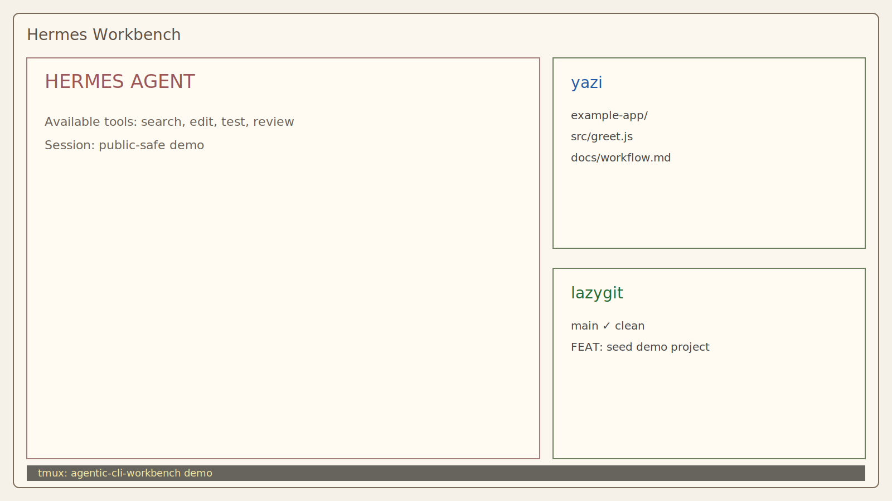

# Agentic CLI Workbench

A tmux-based terminal workbench for agentic coding workflows: agent on one side,
project navigation and git state on the other, with shared layouts across
Windows/WSL and macOS.

This repo is a public, curated version of a private daily-driver setup. It is
meant to show the shape of the workflow without publishing private overlays,
host snapshots, live agent state, account details, or raw screenshots.



## What This Is

The workbench centers on one command:

```bash
ide [session_name] [working_directory]
```

Agent-specific wrappers set the default agent command:

```bash
codex-ide ~/Code/example-app
hermes-ide ~/Code/example-app
opencode-ide ~/Code/example-app
openclaw-ide ~/Code/example-app
```

The default session creates two reference windows with three panes:

- left: agent or shell
- top-right: `yazi`
- bottom-right: `lazygit`

A third window opens the focused agent pane.

## Platform Split

| Layer | Windows/WSL | macOS |
|---|---|---|
| Terminal | WezTerm | Ghostty |
| Theme picker | `weztheme` | `ghosttheme` |
| Shared workbench | tmux, yazi, lazygit, fzf, ripgrep | tmux, yazi, lazygit, fzf, ripgrep |
| Agent wrappers | `codex-ide`, `hermes-ide`, `opencode-ide`, `openclaw-ide` | same wrappers |

## Layouts

- `hermes-ide`: Hermes agent window plus yazi and lazygit reference panes.
- `codex-ide`: Codex CLI launcher; also useful as a navigation cockpit when
  using the Codex app as the primary agent interface.
- `scripts/demo-session`: builds neutral demo fixtures and can launch public-safe
  tmux sessions for screenshots.

## Quickstart

```bash
./scripts/doctor
./scripts/demo-session prepare hermes
./scripts/demo-session show hermes
```

For the Codex screenshot layout:

```bash
./scripts/demo-session kill hermes
./scripts/demo-session prepare codex
./scripts/demo-session show codex
```

Copy or symlink the pieces you want:

```bash
mkdir -p ~/.local/bin ~/.config/tmux ~/.config/yazi ~/.config/lazygit
cp configs/shared/term-scripts/* ~/.local/bin/
cp configs/shared/tmux/tmux.conf ~/.config/tmux/tmux.conf
cp configs/shared/yazi/* ~/.config/yazi/
cp configs/shared/lazygit/config.yml ~/.config/lazygit/config.yml
```

See [docs/overview.md](docs/overview.md), [docs/windows-wsl.md](docs/windows-wsl.md),
and [docs/macos.md](docs/macos.md) for the fuller walkthrough.

## Intentionally Not Included

- private overlays, host snapshots, generated package inventories, or auth state
- raw screenshots containing real repos, git identity, account data, or local
  paths
- live Codex/Hermes/OpenCode configuration with credentials or machine-specific
  trust roots
- a one-command destructive installer

## Commit Style

This repo uses atomic commits with uppercase conventional subjects:

```text
FEAT: add demo session launcher

- Builds neutral fixture repositories for screenshots
- Provides mock panes when optional agent CLIs are unavailable
```
